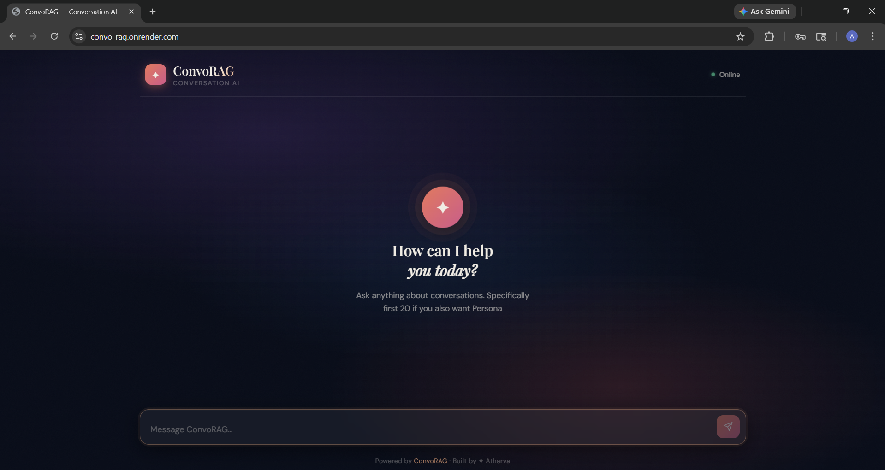
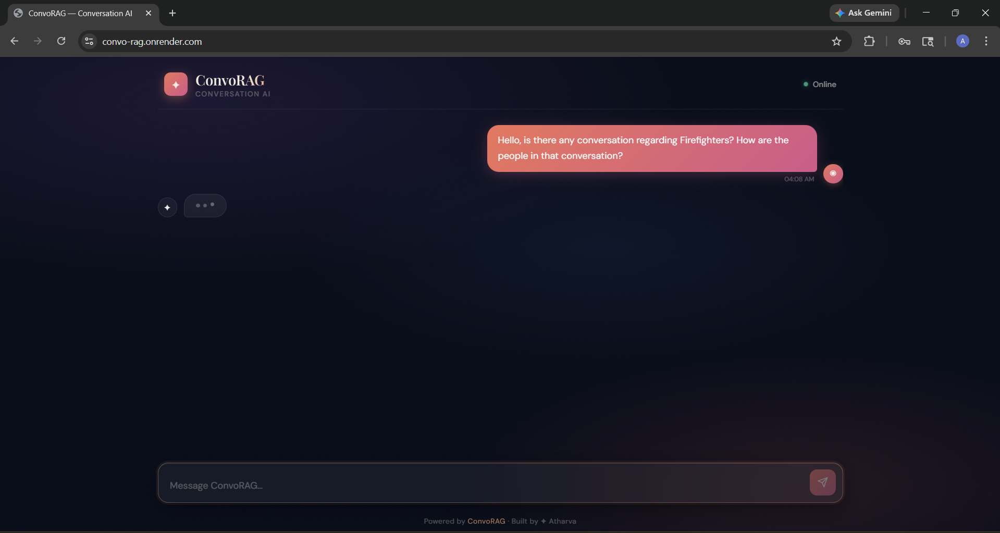
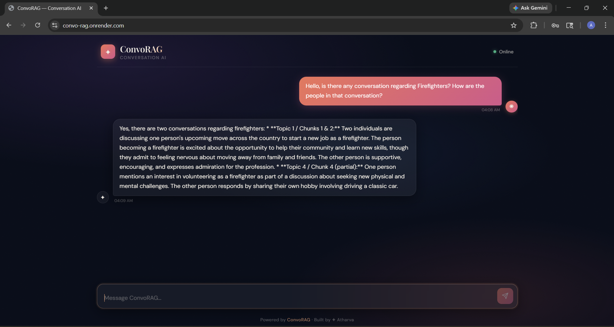

# Convo-RAG

Convo-RAG is a small research-ready conversation retrieval-augmented generation (RAG) system. It indexes conversation segments and topic summaries, retrieves relevant context for a user query, optionally attaches a persona extracted from a conversation, and queries an LLM to produce a grounded reply.

## Demo Media

### Screenshots

#### Index Page



#### Conversation Example


#### Inference



#### Output



### Video Walkthrough

- [Watch Demo Video](assets/Demo.mp4)

This README describes how to set up and run the project, what each component does, and how the core algorithms work (topic change detection, retrieval, persona extraction).

**Quick Start**

- Recommended: Python 3.10+ and a virtual environment. On Windows (PowerShell):

```powershell
python -m venv .venv
.\.venv\Scripts\Activate.ps1
pip install -r requirements.txt
```

- If `faiss-cpu` fails to install via `pip` on Windows, use conda:

```powershell
conda install -c pytorch faiss-cpu -c conda-forge
pip install -r requirements.txt
```

- Set environment variables required for the remote LLM (Gemini): set `GENAI_API_KEY` to a Google GenAI API key if you plan to use `models/gemini`.

PowerShell example (session only):

```powershell
$env:GENAI_API_KEY = "<your-google-genai-api-key>"
```

Or on Linux / macOS (bash):

```bash
export GENAI_API_KEY="<your-google-genai-api-key>"
```

Notes:
- `models/llm.py` uses `ollama` (local host model) for structured JSON extraction and summarization; ensure Ollama is installed and configured if you plan to use the local `llm` backend.
- `models/gemini.py` uses the Google GenAI client and requires `GENAI_API_KEY`.

**Run (quick)**

1. If you only want to run the app with the included preprocessed data (fastest path):

```powershell
uvicorn app:app --reload
# open http://127.0.0.1:8000/
```

2. (Alternate) Serve the frontend separately for development:

```powershell
cd frontend
python -m http.server 3000
# open http://127.0.0.1:3000/
```

The backend exposes a simple API endpoint: POST `/chat` with JSON `{"query": "..."}` and returns `{"response": "..."}`.

**Prebuilt data**

The repository includes a `processed_data/` folder with precomputed artifacts used by the Retriever:

- `chunks.json` — chunked conversation segments
- `chunks.index` — FAISS index for chunk embeddings
- `chunk_map.json` — mapping from FAISS index positions to chunk metadata
- `topics.json` and `topics.index` — topic summaries + FAISS index for topic retrieval
- `personas.json` — extracted persona objects per conversation

If those files are present you can skip the full preprocessing pipeline and run the server directly.

**Regenerate preprocessing & indexes (full flow)**

Run the following sequence (from repository root) to rebuild embeddings, topics, chunks and indexes:

1. Generate message embeddings and topic segmentation:

```powershell
python preprocessing/preprocess.py
```

2. Map messages to conversation ids (depends on the raw CSV):

```powershell
python scripts/build_conv_mapping.py
```

3. Attach conversation ids to detected topics:

```powershell
python scripts/update_topics_with_conv.py
```

4. Create chunks and build FAISS indexes for chunks and topics:

```powershell
python scripts/build_chunks.py
```

5. (Optional) Re-extract personas from conversations (this calls the `llm` interface and will use Ollama by default):

```powershell
python scripts/build_personas.py
```

Notes
- `build_personas.py` calls an LLM and expects a JSON response. If you do not have Ollama configured, edit `models/llm.py` or run the script in an environment with Ollama available.

**API**

- POST `/chat` — body: `{"query": "..."}`; response: `{"response": "..."}`

Behavior summary (server-side):
- The pipeline retrieves relevant chunks and topic summaries, optionally resolves persona when the query is a persona request, builds a prompt containing shortlisted context, and forwards it to the LLM backend (`models/gemini` by default) to generate a final reply.

**How topic changes are detected**

Topic segmentation is implemented in `preprocessing/topic_detector.py`.

Algorithm (plain language):

- Every message is embedded using the same sentence embedding model as the Retriever.
- For each message index i the system computes the mean embedding of a `WINDOW`-sized window before `i` and the mean embedding of a `WINDOW`-sized window after `i`.
- If the cosine similarity between the two window means falls below `SIM_THRESHOLD` and the candidate topic has at least `MIN_TOPIC_SIZE` messages, the pipeline marks a topic boundary and starts a new topic.

Key parameters (as implemented):

- `WINDOW = 5` — the number of messages used on each side to compute window means
- `SIM_THRESHOLD = 0.55` — similarity threshold for a topic break
- `MIN_TOPIC_SIZE = 5` — minimum messages in a topic before committing a break

This approach finds points where the conversation embedding distribution shifts, which aligns well with conversational topic transitions.

**How retrieval works**

The Retriever (`rag/retriever.py`) follows a two-stage retrieval strategy:

1. Embed the user query using `preprocessing/embedder.Embedder` (the repository uses the `sentence-transformers/all-MiniLM-L6-v2` model via `fastembed`).
2. Use FAISS indexes (flat inner-product index built from L2-normalized embeddings) to run a fast nearest-neighbor search. The indexes are prepared in `scripts/build_chunks.py` using `preprocessing/indexer.build_index` (which applies `faiss.normalize_L2` and `IndexFlatIP`).
3. For robustness, the Retriever fetches a larger candidate set from FAISS (`top_k * 3`), then re-computes exact cosine similarities between the query embedding and each candidate’s full embedding (via numpy). It re-ranks candidates by these cosine scores and returns the top K results.

Why rerank: FAISS provides a fast approximate search; reranking with exact cosine on stored embeddings reduces noise and improves relevance.

Defaults used in the pipeline:
- Chunk retrieval: `top_k=8` (pipeline asks for 8 and reranks)
- Topic retrieval: `top_k=5`

**How persona is built**

Persona extraction is implemented in `scripts/build_personas.py`.

Process summary:

1. The script groups processed messages by conversation id (`conv_id`).
2. For each conversation it builds a cleaned conversation text (filters out trivial tokens like "ok", trims length to `MAX_CHARS=2500`).
3. The cleaned conversation text is sent to the `llm` module with a strict prompt that instructs the model to return a JSON object with explicit persona attributes for `user1` and `user2` (fields such as `habits`, `personal_facts`, `personality_traits`, and `communication_style`).
4. The script writes a `personas.json` array of `{ conv_id, persona }` records. These personas are loaded by `RAGPipeline` at startup and used when a query appears to ask about "who" or "describe this person".

Persona routing (when the pipeline decides to attach persona data):
- `rag/router.py` implements a lightweight routing step. It embeds the query and compares it to a small set of persona-anchor phrases (for example, "who is this person", "tell me about their personality"). If the maximum cosine similarity exceeds `0.6` the query is treated as a persona request and the pipeline attempts to fetch persona(s) for the conversation(s) involved.

**Project layout (high level)**

- [app.py](app.py) — FastAPI app and the `/chat` route
- [rag/pipeline.py](rag/pipeline.py) — orchestrates retrieval, persona routing, prompt building and LLM calls
- [rag/retriever.py](rag/retriever.py) — FAISS-backed retriever with reranking
- [rag/prompt_builder.py](rag/prompt_builder.py) — assembles the prompt sent to the LLM
- [rag/router.py](rag/router.py) — simple persona-query detector used at inference time
- [models/gemini.py](models/gemini.py) — Google GenAI client wrapper (expects `GENAI_API_KEY`)
- [models/llm.py](models/llm.py) — Ollama-backed helper used for JSON generation and summarization
- [preprocessing/](preprocessing) — embedding, topic detection, chunking, summarization utilities
- [scripts/](scripts) — orchestration scripts to build chunks, topics, personas, and mappings
- [processed_data/](processed_data) — output artifacts used by the Retriever (indexed JSON + FAISS indices)

**Assets / Demo**

Preview images and the demo video are included in the repository and referenced here so you can quickly inspect the UI and example output:


View the demo video in your local copy:

[Demo video](assets/Demo.mp4)

**Troubleshooting & tips**

- If FAISS installation fails, prefer `conda` on Windows (see section above).
- If `build_personas.py` produces invalid JSON, check `models/llm.py` and that Ollama is available or the `ollama` client returns valid JSON when using `generate_json`.
- To test the Gemini client connectivity, run `python tests/test_gemini.py`.

**Contact & development**

If you want help extending the pipeline (different embedding models, different LLM backends, or experiment with thresholds), open an issue or ask for a short walkthrough and I can help implement and test it.
