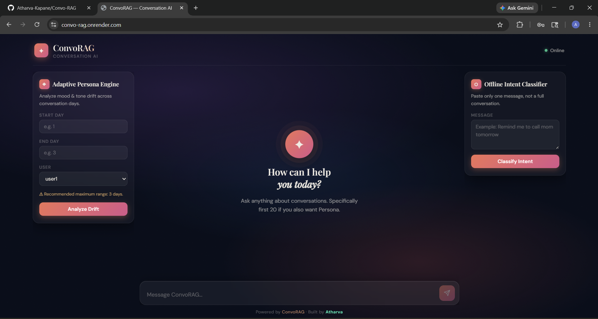
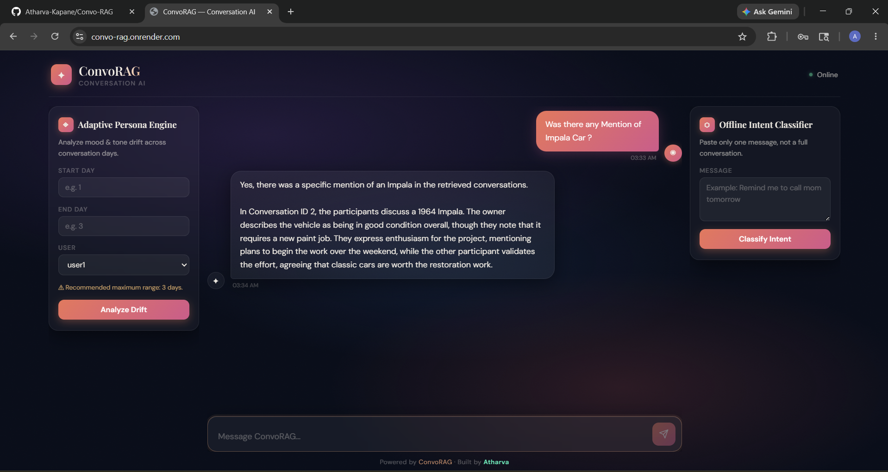
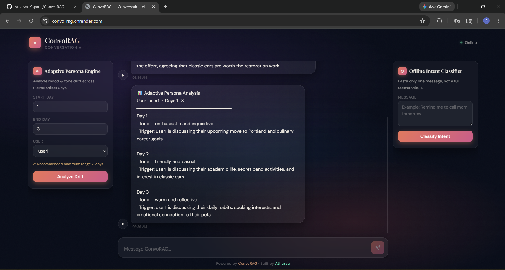
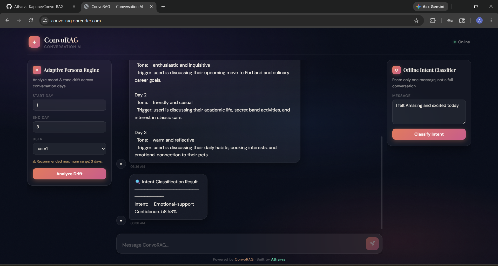

# Convo-RAG

Convo-RAG is a small research-ready conversation retrieval-augmented generation (RAG) system. It indexes conversation segments and topic summaries, retrieves relevant context for a user query, optionally attaches a persona extracted from a conversation, and queries an LLM to produce a grounded reply.

## Demo Media & Features Overview

### Video Walkthrough

- [Watch Demo Video](assets/Demo.mp4)

### Feature Screenshots

#### Unified Multi-Feature Interface



#### RAG Chatbot



#### Adaptive Persona Engine



#### Offline Intent Classifier



---

## New Feature Additions

### 1. Adaptive Persona Engine

The project now includes an advanced **Adaptive Persona Engine** that analyzes how a user's conversational behavior evolves over time instead of generating only a single static personality profile.

#### Core Objective

The goal of this module is to detect:

- **Behavioral drift** — changes in interaction patterns
- **Emotional changes** — shifts in emotional expression
- **Tone evolution** — transformation in conversational tone
- **Style transitions** — changes in communication approach

across different days of interaction.

Instead of treating the user as having one fixed personality, the system tracks how their communication dynamically changes throughout the conversation timeline.

#### Persona Drift Detection

The engine performs:

- **Day-wise behavioral analysis** — examines behavior patterns for each day
- **Tone classification** — identifies emotional and communicative tone
- **Conversational evolution tracking** — measures change across time

The system compares conversations across selected day ranges and identifies shifts in:

- Emotional state
- Interaction style
- Communication tone
- Engagement patterns

**Example temporal personality timeline:**

```
Day 1 → Curious & Formal
Day 4 → Casual & Frustrated
Day 7 → Playful & Relaxed
```

This creates a temporal personality timeline rather than a static summary.

#### Trigger Detection

The system also identifies likely triggers responsible for behavioral changes.

Detected triggers may include:

- **Topics** — specific conversation subjects
- **Events** — significant occurrences
- **People** — individuals involved in conversations
- **Recurring discussion themes** — patterns across multiple conversations
- **Stressful conversations** — emotionally charged interactions
- **Project-related discussions** — work/study-related topics

**Example trigger identification:**

```
"Project deadlines"
"Work discussion"
"Academic stress"
"Social interaction"
```

This makes the persona engine context-aware rather than only sentiment-based.

#### Selective User Analysis

The drift engine supports:

- **User1 analysis** — track primary participant behavior
- **User2 analysis** — track secondary participant behavior

allowing independent behavioral tracking for multiple participants inside the dataset.

#### Controlled Timeline Analysis

To maintain:

- **Focused analysis** — concentrate on relevant time windows
- **Better interpretability** — easier to understand behavioral changes
- **Low latency** — faster analysis and results

the frontend restricts day-range analysis to small windows (recommended maximum range: **3 days**).

This prevents:

- Noisy drift aggregation
- Overly generalized outputs
- Inconsistent behavioral summaries

#### Real-Time Frontend Integration

The Adaptive Persona Engine is fully integrated into the live frontend UI.

**Features:**

- Start day input selector
- End day input selector
- User selector dropdown
- Real-time drift analysis and results

Results are rendered directly inside the main chatbot conversation window to maintain a unified interaction experience.

---

### 2. Offline Intent Classifier

The system now includes a fully **offline lightweight NLP intent classification module**.

Unlike API-dependent approaches, this classifier:

- Runs entirely on CPU
- Requires no external AI API
- Performs inference locally
- Works in real time

This significantly improves:

- **Speed** — no network latency
- **Privacy** — all computation stays local
- **Deployment efficiency** — minimal external dependencies
- **Offline capability** — works without internet connection

#### Supported Intent Categories

The classifier predicts the following intent classes:

| Intent | Description |
|--------|-------------|
| `reminder` | Reminder-related requests |
| `emotional-support` | Emotionally expressive or support-seeking messages |
| `action-item` | Task/action-oriented instructions |
| `small-talk` | Casual conversational interaction |
| `unknown` | Undefined/noisy/random input |

#### Model Architecture

The intent classification pipeline uses a **lightweight traditional ML architecture** optimized for fast CPU inference.

**Pipeline components:**

- **TF-IDF Vectorizer** — converts text to numerical features
- **LinearSVC** — support vector classifier for intent prediction
- **CalibratedClassifierCV** — provides confidence scoring

This design was intentionally selected because it:

- Stays under lightweight deployment limits
- Performs extremely fast inference
- Works well on CPU-only environments
- Avoids GPU dependency
- Supports confidence scoring

#### Text Vectorization

The system uses:

- **Unigram + bigram TF-IDF features** — captures both single words and word pairs
- **Stop-word filtering** — removes common non-semantic words
- **Capped feature dimensions** — reduces memory footprint

This enables efficient semantic representation without requiring transformer-scale models.

#### Confidence-Based Predictions

The classifier provides:

- **Predicted intent** — the detected intent category
- **Confidence score** — probability of the prediction

**Example response:**

```json
{
  "intent": "reminder",
  "confidence": 0.98
}
```

Confidence estimation is enabled through **CalibratedClassifierCV**, which wraps the SVM classifier to generate probability-like outputs.

#### Fully Offline Inference

A major design goal was **complete offline execution**.

The intent module:

- Does not use OpenAI APIs
- Does not use Gemini APIs
- Does not require internet connection
- Does not depend on cloud AI services

This improves:

- **Privacy** — no data leaves the local machine
- **Latency** — instant local processing
- **Portability** — works in any environment
- **Deployment simplicity** — no API key management

#### Lightweight Deployment Optimization

The deployment architecture was optimized specifically for low-resource hosting environments such as Render free-tier instances.

**Optimizations include:**

- Lightweight ML pipeline (traditional ML, not deep learning)
- CPU-only inference (no GPU required)
- Reduced memory footprint
- Fast model loading
- Minimal dependency overhead

This allows the system to remain responsive even under strict RAM constraints.

#### Real-Time Frontend Integration

The intent classifier is fully integrated into the unified frontend interface.

**Users can:**

- Input a single message
- Classify intent instantly
- Receive real-time results with confidence scores

The response is displayed directly inside the chatbot conversation stream for a seamless user experience.

#### Unified Multi-Feature Interface

The frontend architecture was upgraded into a **unified AI workspace** containing:

- **RAG chatbot** — intelligent retrieval-augmented generation
- **Adaptive Persona Engine** — behavioral drift analysis
- **Offline Intent Classifier** — real-time intent detection

All features operate inside a single responsive webpage while preserving:

- Consistent UI design
- Glassmorphism styling
- Responsive layout
- Conversational interaction flow

This creates a more production-oriented user experience rather than separate disconnected tools.

---

This README describes how to set up and run the project, what each component does, and how the core algorithms work (topic change detection, retrieval, persona extraction, intent classification, and behavioral drift detection).

**Quick Start**

- Recommended: Python 3.10+ and a virtual environment. On Windows (PowerShell):

```powershell
python -m venv .venv
.\.venv\Scripts\Activate.ps1
pip install -r requirements.txt
```

- If `faiss-cpu` fails to install via `pip` on Windows, use conda:

```powershell
conda install -c pytorch faiss-cpu -c conda-forge
pip install -r requirements.txt
```

- Set environment variables required for the remote LLM (Gemini): set `GENAI_API_KEY` to a Google GenAI API key if you plan to use `models/gemini`.

PowerShell example (session only):

```powershell
$env:GENAI_API_KEY = "<your-google-genai-api-key>"
```

Or on Linux / macOS (bash):

```bash
export GENAI_API_KEY="<your-google-genai-api-key>"
```

Notes:
- `models/llm.py` uses `ollama` (local host model) for structured JSON extraction and summarization; ensure Ollama is installed and configured if you plan to use the local `llm` backend.
- `models/gemini.py` uses the Google GenAI client and requires `GENAI_API_KEY`.

**Run (quick)**

1. If you only want to run the app with the included preprocessed data (fastest path):

```powershell
uvicorn app:app --reload
# open http://127.0.0.1:8000/
```

2. (Alternate) Serve the frontend separately for development:

```powershell
cd frontend
python -m http.server 3000
# open http://127.0.0.1:3000/
```

The backend exposes a simple API endpoint: POST `/chat` with JSON `{"query": "..."}` and returns `{"response": "..."}`.

**Prebuilt data**

The repository includes a `processed_data/` folder with precomputed artifacts used by the Retriever:

- `chunks.json` — chunked conversation segments
- `chunks.index` — FAISS index for chunk embeddings
- `chunk_map.json` — mapping from FAISS index positions to chunk metadata
- `topics.json` and `topics.index` — topic summaries + FAISS index for topic retrieval
- `personas.json` — extracted persona objects per conversation

If those files are present you can skip the full preprocessing pipeline and run the server directly.

**Regenerate preprocessing & indexes (full flow)**

Run the following sequence (from repository root) to rebuild embeddings, topics, chunks and indexes:

1. Generate message embeddings and topic segmentation:

```powershell
python preprocessing/preprocess.py
```

2. Map messages to conversation ids (depends on the raw CSV):

```powershell
python scripts/build_conv_mapping.py
```

3. Attach conversation ids to detected topics:

```powershell
python scripts/update_topics_with_conv.py
```

4. Create chunks and build FAISS indexes for chunks and topics:

```powershell
python scripts/build_chunks.py
```

5. (Optional) Re-extract personas from conversations (this calls the `llm` interface and will use Ollama by default):

```powershell
python scripts/build_personas.py
```

Notes
- `build_personas.py` calls an LLM and expects a JSON response. If you do not have Ollama configured, edit `models/llm.py` or run the script in an environment with Ollama available.

**API**

- POST `/chat` — body: `{"query": "..."}`; response: `{"response": "..."}`

Behavior summary (server-side):
- The pipeline retrieves relevant chunks and topic summaries, optionally resolves persona when the query is a persona request, builds a prompt containing shortlisted context, and forwards it to the LLM backend (`models/gemini` by default) to generate a final reply.

**How topic changes are detected**

Topic segmentation is implemented in `preprocessing/topic_detector.py`.

Algorithm (plain language):

- Every message is embedded using the same sentence embedding model as the Retriever.
- For each message index i the system computes the mean embedding of a `WINDOW`-sized window before `i` and the mean embedding of a `WINDOW`-sized window after `i`.
- If the cosine similarity between the two window means falls below `SIM_THRESHOLD` and the candidate topic has at least `MIN_TOPIC_SIZE` messages, the pipeline marks a topic boundary and starts a new topic.

Key parameters (as implemented):

- `WINDOW = 5` — the number of messages used on each side to compute window means
- `SIM_THRESHOLD = 0.55` — similarity threshold for a topic break
- `MIN_TOPIC_SIZE = 5` — minimum messages in a topic before committing a break

This approach finds points where the conversation embedding distribution shifts, which aligns well with conversational topic transitions.

**How retrieval works**

The Retriever (`rag/retriever.py`) follows a two-stage retrieval strategy:

1. Embed the user query using `preprocessing/embedder.Embedder` (the repository uses the `sentence-transformers/all-MiniLM-L6-v2` model via `fastembed`).
2. Use FAISS indexes (flat inner-product index built from L2-normalized embeddings) to run a fast nearest-neighbor search. The indexes are prepared in `scripts/build_chunks.py` using `preprocessing/indexer.build_index` (which applies `faiss.normalize_L2` and `IndexFlatIP`).
3. For robustness, the Retriever fetches a larger candidate set from FAISS (`top_k * 3`), then re-computes exact cosine similarities between the query embedding and each candidate’s full embedding (via numpy). It re-ranks candidates by these cosine scores and returns the top K results.

Why rerank: FAISS provides a fast approximate search; reranking with exact cosine on stored embeddings reduces noise and improves relevance.

Defaults used in the pipeline:
- Chunk retrieval: `top_k=8` (pipeline asks for 8 and reranks)
- Topic retrieval: `top_k=5`

**How persona is built**

Persona extraction is implemented in `scripts/build_personas.py`.

Process summary:

1. The script groups processed messages by conversation id (`conv_id`).
2. For each conversation it builds a cleaned conversation text (filters out trivial tokens like "ok", trims length to `MAX_CHARS=2500`).
3. The cleaned conversation text is sent to the `llm` module with a strict prompt that instructs the model to return a JSON object with explicit persona attributes for `user1` and `user2` (fields such as `habits`, `personal_facts`, `personality_traits`, and `communication_style`).
4. The script writes a `personas.json` array of `{ conv_id, persona }` records. These personas are loaded by `RAGPipeline` at startup and used when a query appears to ask about "who" or "describe this person".

Persona routing (when the pipeline decides to attach persona data):
- `rag/router.py` implements a lightweight routing step. It embeds the query and compares it to a small set of persona-anchor phrases (for example, "who is this person", "tell me about their personality"). If the maximum cosine similarity exceeds `0.6` the query is treated as a persona request and the pipeline attempts to fetch persona(s) for the conversation(s) involved.

**Project layout (high level)**

- [app.py](app.py) — FastAPI app and the `/chat` route
- [rag/pipeline.py](rag/pipeline.py) — orchestrates retrieval, persona routing, prompt building and LLM calls
- [rag/retriever.py](rag/retriever.py) — FAISS-backed retriever with reranking
- [rag/prompt_builder.py](rag/prompt_builder.py) — assembles the prompt sent to the LLM
- [rag/router.py](rag/router.py) — simple persona-query detector used at inference time
- [models/gemini.py](models/gemini.py) — Google GenAI client wrapper (expects `GENAI_API_KEY`)
- [models/llm.py](models/llm.py) — Ollama-backed helper used for JSON generation and summarization
- [preprocessing/](preprocessing) — embedding, topic detection, chunking, summarization utilities
- [scripts/](scripts) — orchestration scripts to build chunks, topics, personas, and mappings
- [processed_data/](processed_data) — output artifacts used by the Retriever (indexed JSON + FAISS indices)

**Assets / Demo**

Preview images and the demo video are included in the repository and referenced here so you can quickly inspect the UI and example output:


View the demo video in your local copy:

[Demo video](assets/Demo.mp4)

**Troubleshooting & tips**

- If FAISS installation fails, prefer `conda` on Windows (see section above).
- If `build_personas.py` produces invalid JSON, check `models/llm.py` and that Ollama is available or the `ollama` client returns valid JSON when using `generate_json`.
- To test the Gemini client connectivity, run `python tests/test_gemini.py`.

**Contact & development**

If you want help extending the pipeline (different embedding models, different LLM backends, or experiment with thresholds), open an issue or ask for a short walkthrough and I can help implement and test it.
